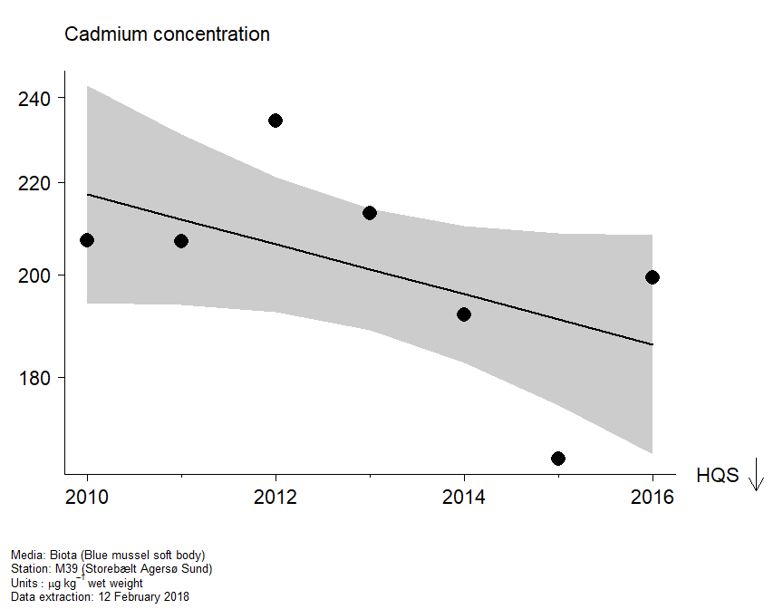
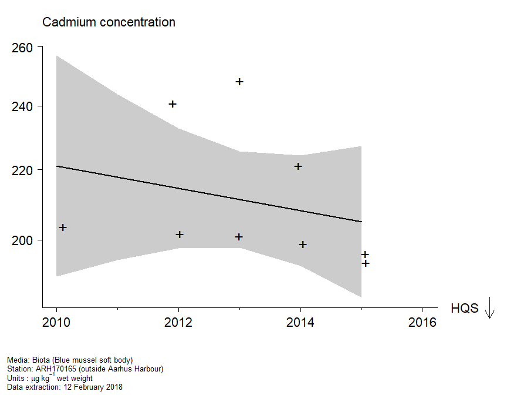
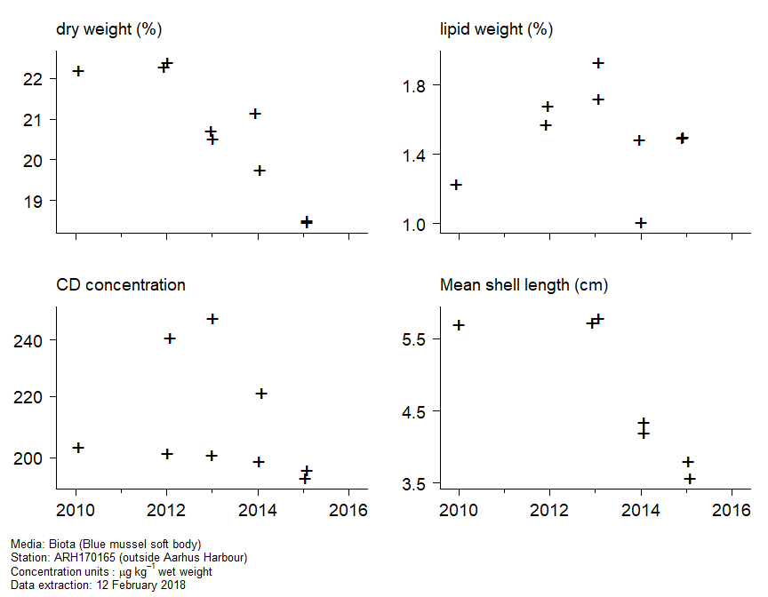
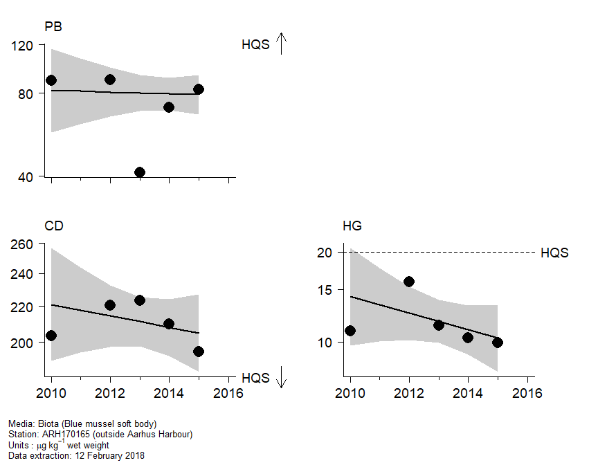
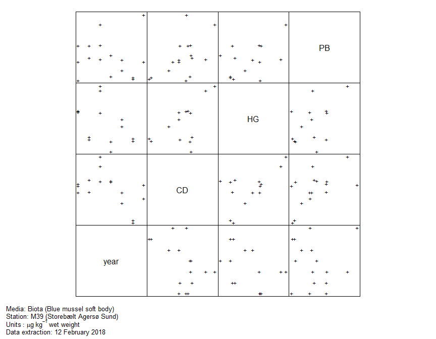

HELCOM Hazardous substances Assessment Tool
================

As an example this markdown document has been produced using the code in
the 2019 folder. In practice, an HTML document will be produced, and
will be available via the link below:

<https://ocean.ices.dk/HHAT/Home/GettrResult?seriesID=Denmark%20ARH170165%20CD%20Mytilus%20edulis%20SB&matrix=Biota&year=2019>

The graphical map interface to all assessments will be found here:
<https://ocean.ices.dk/hhat/>

### Assessment plots and statistical analysis

Will put some introductory text here, including summary information
about the time series, including:

  - station name
  - latitude and longitude
  - region
  - MSTAT
  - compartment
  - determinand
  - units
  - species (if biota)
  - matrix
  - extraction date

<br>

#### Assessment plot

<!-- -->

#### Trend with data

<!-- -->

#### Auxiliary data

<!-- -->

#### Assessments (related compounds)

<!-- -->

#### Data (related compounds)

<!-- -->

#### Statistical analysis

<br>

**Trend assessment**

Analysis of variance

``` 
                Df       AIC       AICc  Log lik  Deviance     Chisq Chi df Pr(>Chisq)
mean             1 -29.53062 -25.030620 17.76531 -35.53062        NA     NA         NA
linear           2 -29.87462 -19.207955 18.93731 -37.87462 2.3440012      1  0.1257662
smooth (df = 2)  3 -28.45124  -3.451244 19.22562 -38.45124 0.5766226      1  0.4476392
```

<br>

Change in log concentration

``` 
              Year start Year end Fit start  Fit end   Change Std error         t Pr(>|t|)
overall             2010     2016  5.381037 5.226617 -0.15442 0.0926443 -1.666805  0.15643
last 20 years       2010     2016  5.381037 5.226617 -0.15442 0.0926443 -1.666805  0.15643
```

<br>

**Status assessment**

``` 
    Conc fitted Conc ref  Log ratio  Std error         t    Pr(>t)
HQS     186.162   137.28 -0.3045947 0.05604806 -5.434527 0.9985693
```

### how to build this file

this file was created using (requires access to
`assessment_platform.RData`)

``` r
rmarkdown::render("README.Rmd")
```
