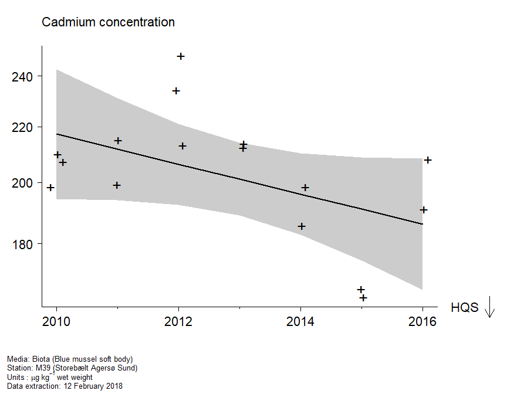
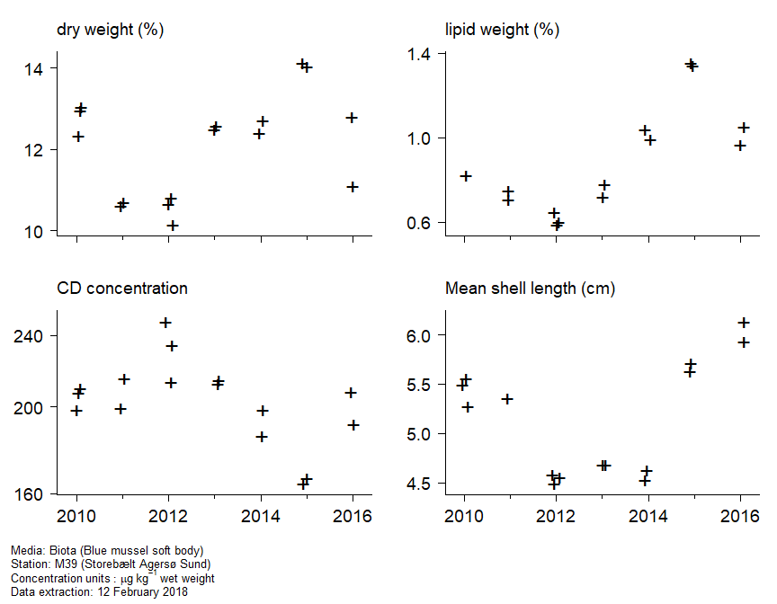
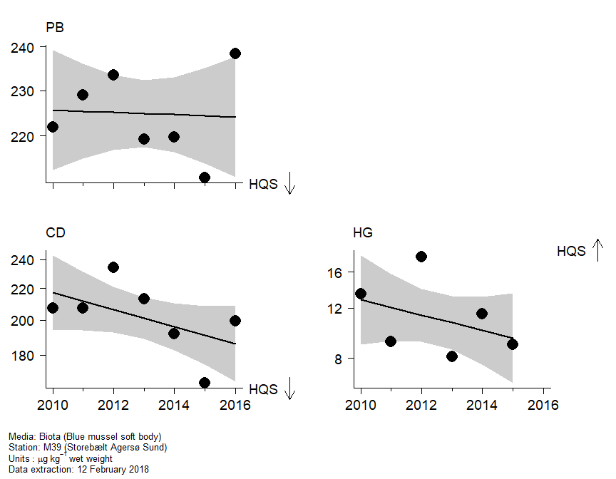

Hazardous substances assessment tool
================

As an example, the code in this repository produces an html version of
the plots and tables shown below.

### Assessment plots

Will put some introductory text here, including summary information
about the time series, including:

  - station name
  - latitude and longitude
  - region
  - MSTAT
  - compartment
  - determinand
  - units
  - species (if biota)
  - matrix
  - extraction date

<br>

#### Assessment plot

<!-- -->

#### Trend with data

<!-- -->

#### Auxiliary data

<!-- -->

#### Assessments (related compounds)

<!-- -->

#### Data (related compounds)

<!-- -->

#### Statistical analysis

<br>

**Trend assessment**

Analysis of
variance

``` 
       Df       AIC      AICc  Log lik  Deviance    Chisq Chi df Pr(>Chisq)
mean    1 -12.45589 -3.455888 9.227944 -18.45589       NA     NA         NA
linear  2 -11.11862 20.881375 9.559312 -19.11862 0.662737      1  0.4155953
```

<br>

Change in log
concentration

``` 
              Year start Year end Fit start  Fit end      Change  Std error          t  Pr(>|t|)
overall             2010     2015  5.398727 5.322813 -0.07591411 0.09121654 -0.8322406 0.4663281
last 20 years       2010     2015  5.398727 5.322813 -0.07591411 0.09121654 -0.8322406 0.4663281
```

<br>

**Status assessment**

``` 
    Conc fitted Conc ref  Log ratio  Std error         t    Pr(>t)
HQS    204.9597   137.28 -0.4007906 0.04382238 -9.145797 0.9986184
```
